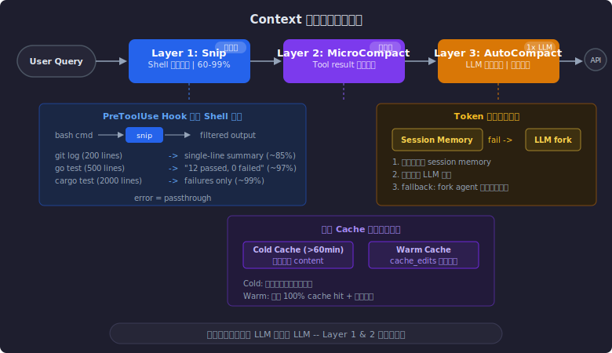

目前 Agent 的能力天花板往往不是模型本身，而是 context window 的管理质量。一个百万 token 的窗口看似宽裕，但在真实的 coding agent 场景下——动辄几十次 tool call、成百上千行的文件读取和 shell 输出——填满它只是时间问题。填满之后怎么办？粗暴截断会丢失关键上下文，导致 agent "失忆"；放任不管又会让模型淹没在噪音中，注意力被稀释，决策质量下降。

Claude Code 对此做了三层递进式压缩：**Snip → MicroCompact → AutoCompact**。这套机制不仅在省 token，降低模型端的服务压力，更直接提升了 agent 的任务完成质量——更少的噪音意味着更精准的注意力分配。本文基于 2026 年 3 月 31 日泄露的 Claude Code 源码（文末可免费下载）和开源社区项目，拆解这三层机制的设计与实现。

## 全局视角：三层压缩的执行链路

在 Claude Code 的 query 主循环中，三层压缩按以下顺序执行：

```typescript title="query.ts"
// 1. Snip: 在输出进入 context 之前拦截
const snipResult = snipModule.snipCompactIfNeeded(messagesForQuery)
messagesForQuery = snipResult.messages
snipTokensFreed = snipResult.tokensFreed

// 2. MicroCompact: 精准清理旧的 tool results
const microcompactResult = await microcompactMessages(messagesForQuery, ...)
messagesForQuery = microcompactResult.messages

// 3. AutoCompact: 超过阈值时，用 LLM 总结整个对话
const shouldCompact = await shouldAutoCompact(
  messages, model, querySource, snipTokensFreed
)
```

三者不是互斥的，而是逐级递进——Snip 做源头拦截，MicroCompact 做存量清理，AutoCompact 是最后防线。整体设计哲学是：**能不调 LLM 就不调 LLM**。Snip 和 MicroCompact 都是纯本地操作，零额外成本；只有当前两层都不够用时，才启动代价最高的 LLM 总结。



## Layer 1: Snip — 在输出进入 context 之前就拦截

Claude Code 内部有一个 `snipCompact` 模块，由 `feature('HISTORY_SNIP')` 控制，其代码并未包含在公开的源码中。但从调用方式可以看出它的定位：**在 MicroCompact 之前执行，返回 `tokensFreed` 供后续阈值判断使用。**

由于原始代码不可用，这里参考 [edouard-claude/snip](https://github.com/edouard-claude/snip) 的实现来分析 snip 的设计思路。该项目是社区基于 Claude Code hook 机制构建的独立 shell 输出过滤工具，Claude Code 内部的 snip 逻辑在策略和细节上可能有所不同。

### 代理与拦截模式

Snip 的核心思想是在 AI Agent 和操作系统 Shell 之间建立一个拦截层：

```
Claude Code → [PreToolUse Hook] → snip → Shell → [过滤输出] → Claude Code
```

通过 Claude Code 的 `PreToolUse` 钩子，当 Claude 准备执行 `bash` 工具时，hook 脚本会将命令改写为 `snip -- <original_command>`，让 snip 代理执行并过滤输出。

### 命令变换与参数注入

Snip 不只是被动过滤，还会主动改造命令以获得更好的结构化输出。例如，对于 `go test`，snip 会自动注入 `-json` 参数，强制产生 JSON 格式的输出，便于后续精确过滤：

```yaml title="go-test.yaml"
- action: "aggregate"
  patterns:
    passed: '"Action":"pass"'
    failed: '"Action":"fail"'
  format: "{{.passed}} passed, {{.failed}} failed"
```

原本几百行的测试日志，经过 aggregate action 聚合后，变成一行 `12 passed, 0 failed`。

### 各类命令的压缩效果

| 命令 | 过滤策略 | 压缩率 |
|:-----|:---------|:-------|
| `git status` | 分类统计文件状态，仅显示摘要 | ~85% |
| `git log` | 提交信息重写为单行摘要 | ~85% |
| `go test` | 注入 JSON 参数，聚合 Pass/Fail | ~97% |
| `cargo test` | 捕获进度条，仅保留失败堆栈 | ~99% |
| `git diff` | 仅保留统计信息，截断超长 diff | ~80% |

### 优雅降级

Snip 的一个重要设计原则是**绝不破坏主链路**。如果过滤器内部出错、找不到匹配的过滤器、或环境配置不全，它会自动退化为 passthrough 模式，原样返回输出。这确保了它作为黑盒代理的安全性。

## Layer 2: MicroCompact — 外科手术式清理 tool results

如果说 Snip 是在源头减少输入，MicroCompact 则是对已经进入 context 的历史消息做精准清理。它只针对特定工具的结果进行处理：

```typescript title="microCompact.ts"
const COMPACTABLE_TOOLS = new Set([
  FILE_READ_TOOL_NAME,    // 文件读取
  ...SHELL_TOOL_NAMES,    // Shell 命令
  GREP_TOOL_NAME,         // 搜索
  GLOB_TOOL_NAME,         // 文件匹配
  WEB_SEARCH_TOOL_NAME,   // 网页搜索
  WEB_FETCH_TOOL_NAME,    // 网页获取
  FILE_EDIT_TOOL_NAME,    // 文件编辑
  FILE_WRITE_TOOL_NAME,   // 文件写入
])
```

关键设计：**清理时保留 tool_use 的 ID 和结构，只移除 content**。这确保模型知道「曾经执行过这个操作」，但不再为其内容占据 token 空间。

### 双轨机制：Cold Cache vs Warm Cache

要理解 MicroCompact 为什么要分两条路径，需要先了解 Prompt Caching 的工作方式。

> **Prompt Caching 快速回顾**
>
> 当你向 Claude API 发送请求时，模型需要对 prompt 中的每个 token 计算 KV（Key-Value）对。Prompt Caching 的核心思想是：**如果两次请求的 prompt 共享相同的前缀，那么这些前缀 token 的 KV 对可以被缓存和复用，无需重新计算。**
>
> 对于 Claude Code 这种多轮对话场景，每一轮新请求都会携带完整的对话历史作为前缀，只要前缀不变，后续请求就能享受 cache read 的低成本——**cache read 的价格仅为 cache write（首次写入）的 1/10**。但反过来，**任何对历史消息的修改都会破坏前缀匹配，导致修改位置之后的所有缓存失效。**


理解了这个约束，MicroCompact 的双轨设计就顺理成章了——本质上就是在回答一个问题：**当前的 prompt cache 是热的还是冷的？**

#### Time-based 路径（Cold Cache）

当对话停顿超过一定时间（Claude Code 默认阈值为 60 分钟），系统判定 prompt cache 已失效（注：Anthropic API 的标准 cache TTL 为 5 分钟，这里的 60 分钟是 Claude Code 自定义的触发阈值，采用更保守的策略来决定何时执行 time-based 清理）。既然下次请求注定要完整重发所有 token，不如趁机"瘦身"：

```typescript title="microCompact.ts"
function maybeTimeBasedMicrocompact(messages, querySource) {
  const trigger = evaluateTimeBasedTrigger(messages, querySource)
  if (!trigger) return null

  // 保留最近 N 个 tool results，清理其余
  const keepSet = new Set(compactableIds.slice(-keepRecent))
  const clearSet = new Set(compactableIds.filter(id => !keepSet.has(id)))

  // 直接替换内容为占位符
  return messages.map(message => {
    // ...
    if (clearSet.has(block.tool_use_id)) {
      return { ...block, content: '[Old tool result content cleared]' }
    }
    // ...
  })
}
```

逻辑直白：cache 反正冷了，直接改消息内容，物理减少发送的 token 量。

#### Cached MC 路径（Warm Cache）

活跃对话中，cache 仍然有效。如果此时直接修改历史消息，会破坏前缀匹配，导致之前所有 cache 失效——代价太大。

Cached MC 的解法是**将「缓存存储」与「模型可见性」解耦**：

1. 发送完整的历史消息到 API（保持 cache 命中）
2. 附带 `cache_edits` 指令，告诉模型在推理时忽略特定 tool result 的内容

```typescript title="microCompact.ts"
async function cachedMicrocompactPath(messages, querySource) {
  // 注册和追踪 tool results
  const toolsToDelete = mod.getToolResultsToDelete(state)

  if (toolsToDelete.length > 0) {
    // 创建 cache_edits 指令（不修改本地消息！）
    const cacheEdits = mod.createCacheEditsBlock(state, toolsToDelete)
    pendingCacheEdits = cacheEdits

    // 消息原样返回，cache_edits 在 API 层注入
    return { messages, compactionInfo: { pendingCacheEdits: { ... } } }
  }
  return { messages }
}
```

这实现了一个看似矛盾的目标：**在不破坏已有 cache 的前提下，减少模型实际处理的 token 数量。**

`cache_edits` 支持两类操作：
- `clear_tool_uses`：屏蔽特定 tool call 的输入或输出
- `clear_thinking`：清除旧的思维链（除最近 1-2 次外，早期推理过程通常已无必要）

### cache_edits：Agent 与 Model 的协同优化

值得注意的是，`cache_edits` 不是纯客户端的技巧——它要求模型推理引擎在底层配合，能够在保持 KV cache 完整的前提下，根据客户端指令在推理时跳过特定内容。这是一个 **agent 端和 model 端协同优化**的典型案例，也是 Anthropic 作为同时掌控模型和 agent 产品的厂商的核心竞争力之一。目前 `cache_edits` 是 Claude Code 内部使用的能力，尚未作为公开 API 提供。

横向对比来看，各家在缓存管理上的深度差异很大：

| 提供商 | 缓存触发方式 | 是否支持缓存编辑 | 缓存失效机制 |
|:-------|:-------------|:-----------------|:-------------|
| **Anthropic** | 显式标记 (`cache_control`) | **是** (`cache_edits`) | 按 TTL 或手动覆盖 |
| **Google** | 显式创建 (`CachedContent`) | 仅管理（TTL/删除） | 固定 TTL（默认 1h） |
| **DeepSeek** | 自动触发 | 否（仅前缀匹配） | 动态过期（硬盘存储） |
| **OpenAI** | 自动触发 | 否 | 精确匹配失效 |

大多数提供商的 prompt cache 是"只读"的——你只能通过保持前缀不变来利用它，一旦中间有修改就全部失效。Anthropic 的 `cache_edits` 打破了这个限制，允许在不破坏缓存的前提下对 context 做"外科手术式"编辑。这使得 Claude Code 能在活跃对话中实现 MicroCompact，而其他提供商上的 agent 只能等 cache 过期后才能清理。

### Token 估算的保守策略

由于无法在发送前获得精确的 API token 计数，MicroCompact 对本地估算的 token 数做了 4/3 的加权处理：

```typescript title="microCompact.ts"
export function estimateMessageTokens(messages: Message[]): number {
  // ... 遍历所有 block 累加 token
  // 4/3 加权，确保在接近上限时提前触发压缩
  return Math.ceil(totalTokens * (4 / 3))
}
```

宁可多压缩一点，也不能让请求因溢出而失败。

## Layer 3: AutoCompact — 最后防线

当 Snip 和 MicroCompact 都不够用时，AutoCompact 作为最后一道防线介入。它的触发条件是 token 使用量超过 `effectiveContextWindow - 13K buffer`：

```typescript title="autoCompact.ts"
export const AUTOCOMPACT_BUFFER_TOKENS = 13_000

export function getAutoCompactThreshold(model: string): number {
  const effectiveContextWindow = getEffectiveContextWindowSize(model)
  return effectiveContextWindow - AUTOCOMPACT_BUFFER_TOKENS
}
```

### 优先级：Session Memory > LLM Summarization

AutoCompact 并不直接调用 LLM 总结。它先尝试一个更轻量的方案：

```typescript title="autoCompact.ts"
export async function autoCompactIfNeeded(messages, ...) {
  // 优先尝试 Session Memory Compaction
  const sessionMemoryResult = await trySessionMemoryCompaction(
    messages, agentId, autoCompactThreshold
  )
  if (sessionMemoryResult) {
    return { wasCompacted: true, compactionResult: sessionMemoryResult }
  }

  // fallback: 传统 LLM 总结
  const compactionResult = await compactConversation(messages, ...)
  return { wasCompacted: true, compactionResult }
}
```

**Session Memory Compaction** 利用 Claude Code 在对话过程中持续维护的 session memory（一个结构化的会话记忆文件）。当需要压缩时，直接用这个已有的记忆作为摘要，保留最近 10K-40K tokens 的原始消息，无需额外 LLM 调用。

只有当 session memory 不可用（未启用、内容为空、或压缩后仍超阈值）时，才 fallback 到传统的 LLM 总结。

### 传统 Compaction：fork agent 做总结

传统路径会 fork 一个 agent，用专门设计的 prompt 总结对话。这个 prompt 要求生成 9 个结构化 section：

```
1. Primary Request and Intent
2. Key Technical Concepts
3. Files and Code Sections（含代码片段）
4. Errors and fixes
5. Problem Solving
6. All user messages（完整保留用户原话）
7. Pending Tasks
8. Current Work
9. Optional Next Step（含原文引用，防止任务漂移）
```

其中两个设计值得注意：

- **analysis + summary 两阶段**：prompt 要求先在 `<analysis>` 标签中整理思路，再在 `<summary>` 中给出最终总结。`<analysis>` 部分在使用时会被 `formatCompactSummary` 函数剥离——它只是用来提升总结质量的 "草稿纸"，不会进入后续 context
- **Partial Compact**：支持只总结旧消息、保留近期消息原文。这比全量总结保留了更多细节

### 安全机制

AutoCompact 有两个关键的安全设计：

**Circuit Breaker**：连续 3 次压缩失败后，停止重试。这防止了 context 不可恢复地超限时，无意义的 API 调用风暴：

```typescript title="autoCompact.ts"
const MAX_CONSECUTIVE_AUTOCOMPACT_FAILURES = 3
// BQ 2026-03-10: 1,279 sessions had 50+ consecutive failures (up to 3,272)
// in a single session, wasting ~250K API calls/day globally.
```

**PTL Retry**：当 compact 请求本身因为 prompt 过长而失败时，逐步从最旧的消息组开始截断，直到请求能通过：

```typescript title="compact.ts"
export function truncateHeadForPTLRetry(messages, ptlResponse) {
  const groups = groupMessagesByApiRound(messages)
  // 根据 token gap 计算需要丢弃的组数，或 fallback 到 20%
  const dropCount = tokenGap !== undefined
    ? /* 精确计算 */ ...
    : Math.max(1, Math.floor(groups.length * 0.2))
  return groups.slice(dropCount).flat()
}
```

## 总结

对于 agent 开发者来说，这篇文章的核心 takeaway 不只是"怎么压缩 context"，而是 **context 管理本身就是 agent 能力的一部分**。具体来说：

1. **分层设计优于单一策略**——零成本的本地操作（Snip、MicroCompact）覆盖绝大多数场景，LLM 总结只是最后防线。不是每次都需要动用最重的工具
2. **Cache-aware 是关键约束**——在有 prompt cache 的系统中，"压缩 context"和"保持 cache 命中"是一对张力。MicroCompact 的双轨设计展示了如何在这个约束下做工程权衡
3. **精心管理的 context = 更好的任务完成质量**——更少的噪音意味着更精准的注意力分配，这直接影响 agent 的决策质量，而不仅仅是省钱

本文所引用的 Claude Code 源码包含在下方附件中，欢迎自行探索更多细节。

**附件**：[claude-code-main.zip](/downloads/claude-code-main.zip) — 2026 年 3 月 31 日泄露的 Claude Code 源码（用于本文分析）
