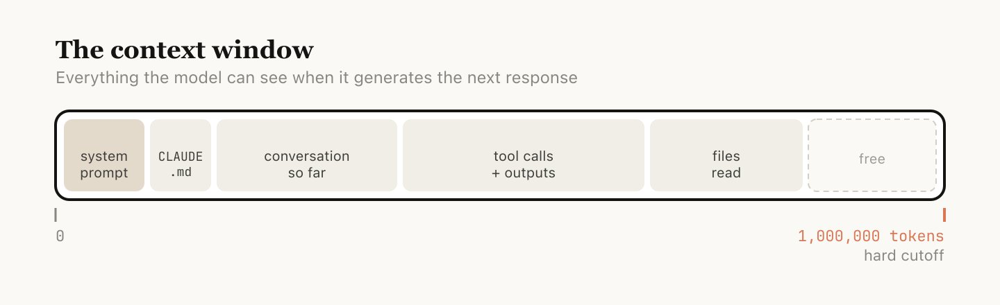
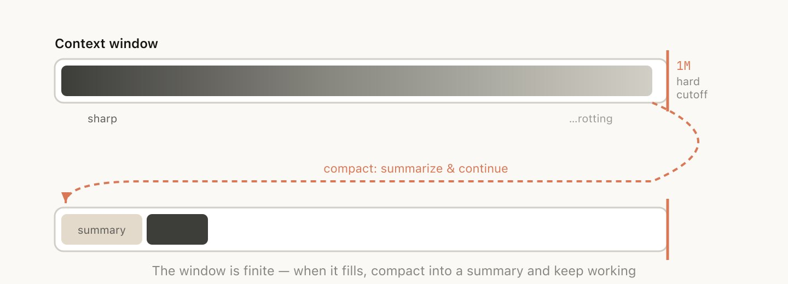
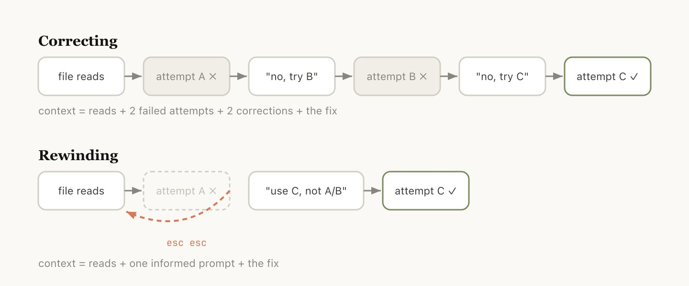
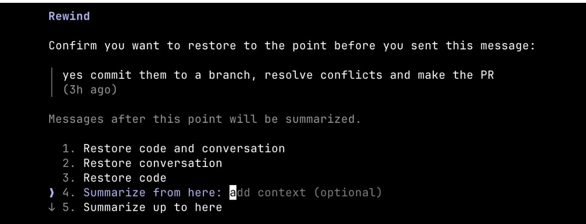
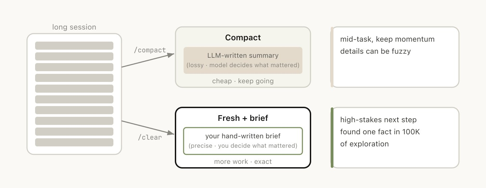
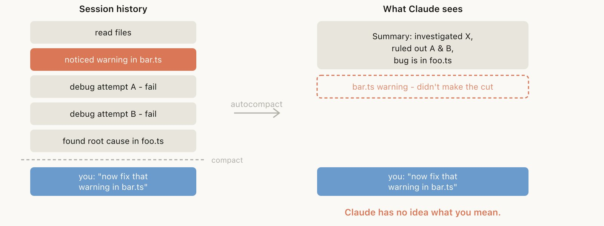
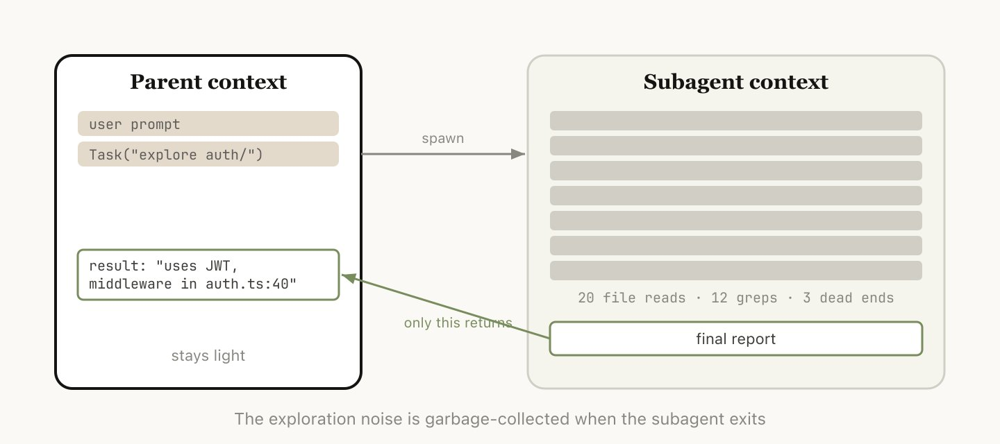
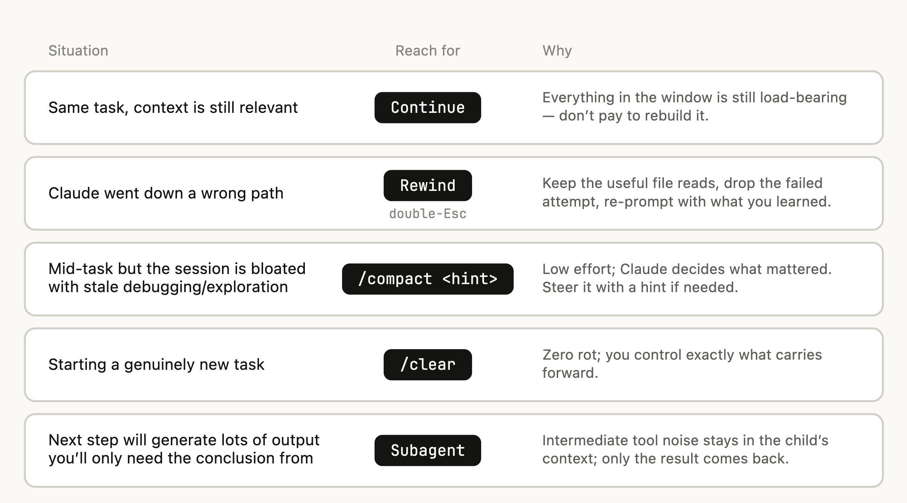

> 原文：[Using Claude Code: Session Management & 1M Context](https://x.com/trq212/status/2044548257058328723)
> 原作者：Thariq（[@trq212](https://x.com/trq212)）— Claude Code 工程师。曾就职 YC W20、MIT Media Lab。

今天，我们为 `/usage` 命令推出了一项全新更新，旨在帮助你更清晰地了解自己在 Claude Code 中的使用情况。这个决定的背后，是我们近期与用户进行的多次深入交流。

在这些交流中，一个反复浮现的话题是：不同用户管理会话的方式差异极大，尤其是在 Claude Code 新增 100 万上下文之后。

你是只在终端里保持一两个会话常驻？还是每次提示词都开一个新会话？什么时候该用 compact、rewind 或 subagents？什么会导致一次糟糕的 compact？

这里面的门道比想象中多得多，而且会切实影响你使用 Claude Code 的体验。而几乎所有这些问题，本质上都归结为对上下文窗口的管理。

## 上下文、压缩与上下文腐化速览

上下文窗口是模型在生成下一次回复时能一次性"看见"的全部内容，包括系统提示词、到目前为止的对话、每一次工具调用及其输出，以及所有被读取过的文件。Claude Code 的上下文窗口为 100 万 token。

不过，使用上下文本身是有代价的——这种现象通常被称为上下文腐化（context rot）。简单来说，随着上下文不断膨胀，模型的注意力被摊薄到更多 token 上，早期那些不再相关的内容开始干扰当前任务，性能因此下降。

上下文窗口存在硬性上限。当你快要触顶时，就需要将当前工作浓缩为一段更精简的描述，然后在新的上下文窗口中继续——这就是压缩（compaction）。你也可以手动触发压缩。

## 每一轮都是一个分岔点

假设你刚让 Claude 做了一件事，它也已经完成了。此时你的上下文里已经有了一些信息：工具调用、工具输出、你的指令。接下来你其实有相当多的选择：

- 继续：在同一个会话里再发一条消息
- `/rewind`（Esc Esc）：跳回到之前某条消息，从那里重新尝试
- `/clear`：开启新会话，通常附上一段你从刚才的工作中提炼出的简要说明
- Compact：总结到目前为止的会话，然后基于这份总结继续
- Subagents：把下一段工作委派给一个拥有干净上下文的代理，只把它的结果带回当前会话

最自然的做法当然是继续发消息，但另外四个选项存在的目的，都是帮助你管理上下文。

## 什么时候该开始新会话

什么时候该保留一个长会话，什么时候又该另起炉灶？我们的经验法则是：新任务，新会话。

100 万上下文窗口确实意味着你现在可以更可靠地完成更长的任务，比如从零开始构建一个完整的全栈应用。

但有时你会处理一些相关任务，其中一部分上下文仍然必要，但并非全部。例如，为你刚实现的功能编写文档。虽然你可以开启新会话，但 Claude 需要重新读取你刚实现的那些文件，这会更慢，也更贵。

## 用回退代替纠正

如果只能推荐一个体现良好上下文管理的习惯，那就是 rewind。

在 Claude Code 中，双击 Esc（或运行 `/rewind`）可以让你跳回任意一条之前的消息，并从那里重新输入提示词。该时间点之后的消息会从上下文中移除。

相比直接纠正，rewind 往往是更好的选择。举个例子：Claude 读取了五个文件，尝试了一种方案，但没有成功。你的直觉可能是输入"这不行，换成 X 试试"。但更好的做法是回退到刚读完文件之后的位置，然后带着你刚学到的信息重新提示："不要用方案 A，foo 模块没有暴露那个接口，直接走 B。"

你也可以使用 "summarize from here"，让 Claude 总结它的发现并创建一条交接消息——有点像未来的 Claude 给过去的自己留了张纸条："我试过了，这条路走不通。"

## 压缩与全新会话

当一个会话变得很长时，你有两种方式可以减负：`/compact` 或 `/clear`（然后重新开始）。它们感觉相似，但行为非常不同。

Compact 会让模型总结到目前为止的对话，然后用这份总结替换掉历史记录。这是一个有损过程——你把"什么值得保留"的判断权交给了 Claude。好处是你不需要动手写任何东西，而且 Claude 在纳入关键发现和文件方面可能比你更全面。你也可以通过传入指令来引导它，例如：`/compact focus on the auth refactor, drop the test debugging`。

使用 `/clear` 时，你需要亲手写下重要内容："我们正在重构 auth middleware，约束是 X，相关文件是 A 和 B，我们已经排除了方案 Y"——然后干净地重新开始。这更费事，但最终上下文中保留的内容完全由你决定。

## 什么会导致糟糕的 Compact？

如果你经常跑长会话，可能已经遇到过压缩效果特别差的情况。我们发现，糟糕的压缩往往发生在模型无法预判你接下来要做什么的时候。

比如，自动压缩在一次漫长的调试会话之后触发，总结了这次排查过程。而你的下一条消息是："现在修一下我们在 bar.ts 里看到的另一个 warning。"

但由于这个会话之前聚焦在调试上，那个"另一个 warning"可能已经从总结中被丢掉了。

这尤其棘手——受上下文腐化影响，模型在执行压缩时恰好处于它最不聪明的状态。好在有了 100 万上下文之后，你会有更充裕的时间主动使用 `/compact`，并附带说明你接下来想做什么。

## Subagents 与全新的上下文窗口

Subagents 本质上也是一种上下文管理手段，适用于你提前知道某段工作会产生大量中间输出、而这些输出之后不再需要的场景。

当 Claude 通过 Agent 工具派生出一个 subagent 时，这个 subagent 会获得自己的全新上下文窗口。它可以按需完成大量工作，然后综合结果，只将最终报告返回给父会话。

我们的判断标准很简单：之后还需要这些工具输出本身，还是只需要结论？

虽然 Claude Code 会自动调用 subagents，但你也可以主动要求它这样做。例如：

- "启动一个 subagent，根据下面这个 spec 文件验证这项工作的结果"
- "派生一个 subagent，阅读另一个代码库并总结它是如何实现 auth flow 的，然后你自己用同样方式实现"
- "派生一个 subagent，根据我的 git changes 为这个功能编写文档"

## 总结

总之，每当 Claude 结束一轮回复、而你准备发送下一条消息时，你就站在了一个决策点上。

未来，我们预期 Claude 能自主处理这些决策。但就目前而言，主动管理上下文仍然是你引导 Claude 产出更好结果的重要手段。

