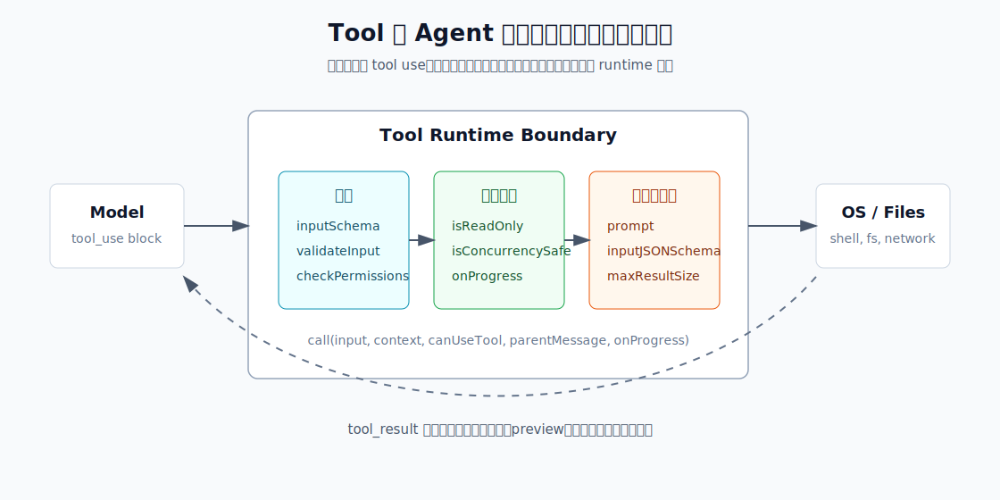

很多人第一次实现 coding agent，最容易想到的工具接口是：

```typescript
async function run(command: string) {
  return await sh(command)
}
```

看起来已经够了。模型会写命令，系统执行命令，把 stdout/stderr 塞回上下文，下一轮继续推理。早期 demo 这么做完全没问题，但一旦进入真实工程环境，这个抽象很快就会崩。

原因不是 shell 不够强，而是它太强。`sh` 同时覆盖读取、搜索、编译、测试、网络访问、文件修改、后台任务、权限提升、进程管理、重定向、管道、子 shell、命令替换等行为。对 agent 来说，裸 shell 是一个没有边界的万能出口。

对系统来说，问题在于一段 command string 几乎不携带结构化语义。系统看到 `npm test`、`grep -R foo .`、`sed -i ...`、`git push` 时，首先看到的都只是字符串；它不知道这个调用主要是读还是写、会影响哪些路径、能不能和其他操作并发、是否应该走权限弹窗、输出可能有多大、失败结果应该如何反馈给模型。除非系统重新解析 shell，并额外补上这些语义，否则它只能在“全部放行”和“每次都问”之间做粗糙选择。

Claude Code 的 tools 层解决的正是这个问题：它不是把 shell 暴露给模型，而是在模型和操作系统之间建立一层**可描述、可校验、可授权、可并发调度、可观测、可压缩上下文**的执行边界。

本文基于 2026 年 3 月 31 日泄露的 Claude Code 源码（文末可免费下载）和 `references/proj-understand-harness/claude-code-main` 中的实现，拆解 Claude Code tools 系统的设计。

## 为什么不能只给 Agent 一个 sh？

裸 shell 的第一个问题是**权限不可表达**。

`ls src`、`cat package.json`、`npm test`、`rm -rf dist`、`git push`、`curl | sh` 都是字符串。系统如果只看到一段 command string，就只能在执行前做粗糙的字符串匹配，或者干脆每次都问用户。前者容易漏，后者会把用户淹没在权限弹窗里。

第二个问题是**并发不可判断**。

一个模型回复里可能同时包含多个 tool use。`Read(a.ts)` 和 `Grep(foo)` 可以并发；`Edit(a.ts)` 和 `Bash(npm test)` 最好按顺序；两个写同一个文件的操作更不能乱跑。如果所有东西都是 `sh`，主循环很难知道哪些调用可以并发，哪些必须串行。

第三个问题是**结果不可控**。

真实命令输出很容易爆炸：测试日志、构建日志、`grep -R`、`find`、`npm install`。如果原样塞回 context window，几十次工具调用后上下文会被日志污染。上一篇 context engineering 里讲的 Snip、MicroCompact、AutoCompact，解决的是上下文膨胀；但 tools 层本身也要先做第一道结果管理。

第四个问题是**交互不可恢复**。

命令可能长时间运行、卡住、需要后台化、被用户中断、输出图片、写入文件、触发 hook、被权限拒绝。一个可靠的 agent runtime 不能只返回 `{ stdout, stderr }`，它还要知道执行中发生了什么，如何展示进度，如何把失败反馈给模型，如何让用户介入。

所以 Claude Code 没有把 tools 做成一组简单函数，而是定义了一套执行协议。

## Tool.ts：工具调用的控制面

Claude Code 的核心抽象在 `src/Tool.ts`。表面上看，一个 `Tool` 只是 `name + inputSchema + call()`；但真正重要的是，`Tool` 把一次工具调用拆成了三组控制面：



第一组是**校验类字段**：`inputSchema`、`validateInput`、`checkPermissions`。它们回答的是：模型传来的参数是否合法？这个调用在语义上是否成立？当前权限模式下是否允许执行？

第二组是**执行编排字段**：`call`、`onProgress`、`isReadOnly`、`isConcurrencySafe`。它们回答的是：工具如何执行？执行中如何反馈？这个调用是否会改变外部状态？能否和其他工具并发？

第三组是**上下文工程字段**：`prompt`、`inputJSONSchema`、`maxResultSizeChars`、`mapToolResultToToolResultBlockParam`。它们回答的是：模型在 context window 里看到什么工具说明？MCP 等外部工具如何直接提供 JSON Schema？结果以什么形式回到模型？大结果如何避免污染上下文？

把这些字段放在一起看，`Tool` 就不再是一个函数接口，而是 agent runtime 对真实世界操作的边界协议。

### 1. 校验：先证明这个调用可以执行

工具执行前，Claude Code 会先用 schema 校验模型传来的参数：

```typescript title="toolExecution.ts"
const parsedInput = tool.inputSchema.safeParse(input)
if (!parsedInput.success) {
  return tool_use_error
}
```

这一步处理的是**数据格式**问题。模型生成 tool call 参数并不总是合法，schema 失败时，Claude Code 不会猜测执行，而是把结构化错误作为 tool result 返回给模型，让模型自己修正参数。

schema 之后还有语义校验。`validateInput` 不是权限系统，而是工具自己的“这个调用有没有意义”。例如 BashTool 会拦截较长的 `sleep N`，提示模型使用后台任务或 Monitor tool，而不是让前台命令长时间占住主循环。

最后才是权限检查。通用权限逻辑在 `utils/permissions/permissions.ts`，但每个工具可以实现自己的 `checkPermissions`：

```typescript title="BashTool.tsx"
async checkPermissions(input, context) {
  return bashToolHasPermission(input, context)
}
```

这意味着权限不是简单的 “Bash 允许/拒绝”。BashTool 会继续解析 command，匹配 `Bash(git status:*)` 这样的内容规则，识别管道、重定向、复合命令、路径约束、安全 wrapper、sandbox auto-allow、deny/ask/allow 规则和 classifier 结果。

通用权限流程大致是：

1. 先看整个 tool 是否被 deny。
2. 再看整个 tool 是否 always ask。
3. 调用 tool 自己的 `checkPermissions`。
4. 工具返回 deny 或安全检查 ask 时，直接尊重。
5. bypass / acceptEdits / auto 等模式再介入。
6. 仍然是 passthrough 的调用转成 ask，让用户决定。

这个顺序体现了一个原则：**工具内的内容级安全判断优先于全局便利模式**。某些敏感路径检查即使在 bypass 模式也必须 prompt。

### 2. 执行编排：并发由 runtime 决定，不由模型决定

模型可能一次返回多个 tool use，但能不能并发，不应该由模型自己说了算。Claude Code 的 `toolOrchestration.ts` 会把一次 assistant message 中的多个 tool use 分批：

```typescript title="toolOrchestration.ts"
if (isConcurrencySafe && previousBatch.isConcurrencySafe) {
  previousBatch.blocks.push(toolUse)
} else {
  batches.push({ isConcurrencySafe, blocks: [toolUse] })
}
```

并发安全的连续工具会并行跑，非并发安全工具会串行跑。默认值很保守：

```typescript title="Tool.ts"
isConcurrencySafe: () => false
isReadOnly: () => false
```

也就是说，一个工具如果没有明确声明自己安全，就不会被并发调度。

BashTool 的实现很典型：只有当一个 shell 命令被判定为 read-only，它才可能和其他 read-only 工具并发。

```typescript title="BashTool.tsx"
isConcurrencySafe(input) {
  return this.isReadOnly?.(input) ?? false
}

isReadOnly(input) {
  const compoundCommandHasCd = commandHasAnyCd(input.command)
  const result = checkReadOnlyConstraints(input, compoundCommandHasCd)
  return result.behavior === 'allow'
}
```

这里有一个容易误解的点：Claude Code 并没有做“路径级 read/write 冲突图”。例如理论上 `Write(a.ts)` 和 `Read(b.ts)` 可以并发，`Write(a.ts)` 和 `Read(a.ts)` 不应该并发；两个写不同文件的操作也未必一定冲突。但源码里的调度策略没有细到这个层面。

它的实际规则更简单，也更保守：

- `FileReadTool` 明确声明 `isConcurrencySafe() = true`、`isReadOnly() = true`。
- `FileWriteTool` 和 `FileEditTool` 没有声明并发安全，因此使用 `buildTool` 默认的 `isConcurrencySafe() = false`。
- `partitionToolCalls()` 只会把**连续的 concurrency-safe tool use** 合并成并发批次。
- 一旦遇到非并发安全工具，它会单独成为一个串行批次，前后的读操作也会被批次边界隔开。

所以如果模型一次返回：

```text
Read(a.ts), Read(b.ts), Write(a.ts), Read(a.ts)
```

调度结果会是：

```text
[Read(a.ts), Read(b.ts)] 并发
[Write(a.ts)] 串行
[Read(a.ts)] 串行等待前面的 Write 完成
```

Claude Code 通过“写操作整体不并发”绕开了路径级冲突分析。文件写入还有另一层防护：`FileWriteTool` / `FileEditTool` 的 `validateInput()` 会检查目标文件是否已经被读过，以及文件 mtime 是否在读取后被用户或 formatter/linter 修改过。如果文件变了，写入会失败并要求模型重新 Read。

### 3. 上下文工程：工具说明和工具结果都有预算

`prompt()` 返回的是工具描述，也就是 API tool schema 里的 `description`。在 `toolToAPISchema` 里，Claude Code 会把 tool 转成 Anthropic API 接受的 schema。内置工具通常从 Zod `inputSchema` 转成 JSON Schema；MCP 或 synthetic output 这类外部/动态工具则可以直接提供 `inputJSONSchema`：

```typescript title="utils/api.ts"
base = {
  name: tool.name,
  description: await tool.prompt(...),
  input_schema,
}
```

这里有一个容易被忽略的优化：tool schema 会做 per-session cache，避免 feature flag 或 `tool.prompt()` 的细微变化导致工具数组字节变化，从而破坏 prompt cache。

工具结果也有预算。每个工具声明 `maxResultSizeChars`。执行完成后，`toolExecution.ts` 会把工具输出映射成 API `tool_result`，再经过 `processToolResultBlock`：

```typescript title="toolResultStorage.ts"
if (size > threshold) {
  const result = await persistToolResult(content, toolUseId)
  return { ...toolResultBlock, content: buildLargeToolResultMessage(result) }
}
```

大结果不会被硬截断，而是持久化到 session 的 `tool-results` 目录，模型只看到路径和 preview。BashTool 还在自身内部处理超大 shell 输出：如果底层命令写出了 output file，它会复制或 hardlink 到 tool-results，并在结果里放 `persistedOutputPath`。

FileReadTool 则把阈值设成 `Infinity`，因为 Read 本身已经有读取限制；如果把 Read 结果再持久化成文件，会形成 “Read → file → Read” 的循环。

这说明 Claude Code 的上下文管理不是压缩阶段才开始，而是从工具说明和工具输出产生的那一刻就开始。

## Case Study：BashTool 如何把 shell 变成可控工具

BashTool 是最能体现 Claude Code tools 层复杂度的工具。它看起来只是 `Run shell command`，实际承担了 shell 语义解析、安全判断、沙箱、后台任务、输出管理和进度上报。

### 输入不是只有 command

BashTool schema 包含：

- `command`：要执行的命令。
- `timeout`：超时时间。
- `description`：模型对命令意图的短描述。
- `run_in_background`：是否后台运行。
- `dangerouslyDisableSandbox`：显式请求绕过沙箱。
- `_simulatedSedEdit`：内部字段，不暴露给模型。

`_simulatedSedEdit` 是一个很好的例子。Claude Code 支持把某些 `sed` 原地编辑识别成可预览的文件编辑。用户批准后，权限系统注入模拟后的新内容，BashTool 直接应用文件修改，而不是重新执行 `sed`。同时 schema 会从模型可见字段里删掉 `_simulatedSedEdit`，避免模型伪造内部字段绕过权限。

### 权限不是 regex，而是 shell 解析

`bashToolHasPermission` 先尝试 tree-sitter bash AST 解析。解析结果分几类：

- `simple`：能拆成清晰的 simple commands。
- `too-complex`：包含无法可靠静态分析的结构，例如复杂展开或控制流。
- `parse-unavailable`：tree-sitter 不可用时走 legacy shell-quote 路径。

对于 `too-complex`，Claude Code 的策略是 fail safe：先尊重 deny/ask/allow 的精确规则；如果无法证明安全，就 ask。

对于 `simple`，它会继续做语义检查，例如危险 builtin、wrapper stripping、路径约束、重定向、管道和复合命令。deny/ask 规则会做更激进的 env var stripping，防止 `FOO=bar rm ...` 绕过 `Bash(rm:*)`；allow 规则则更保守，只剥离安全 env vars，避免把危险环境变量下的命令误判为已允许。

这里的细节很工程化：比如 `timeout -k$(id) 10 ls` 这种 wrapper 参数如果用宽松正则剥离，就可能把危险部分藏在 wrapper flag 里，让剩余 `ls` 命中 allow rule。源码里专门用 allowlist 限制 timeout flag value，避免这种解析差异。

### 执行不是 exec 一次就结束

BashTool 的 `call()` 调用 `runShellCommand` generator，边执行边消费 progress：

```typescript title="BashTool.tsx"
onProgress({
  toolUseID: `bash-progress-${progressCounter++}`,
  data: {
    type: 'bash_progress',
    output: progress.output,
    elapsedTimeSeconds: progress.elapsedTimeSeconds,
    totalLines: progress.totalLines,
    totalBytes: progress.totalBytes,
  }
})
```

这让终端 UI 可以显示滚动进度，也让系统知道工具仍然活着。对 coding agent 来说，这不是锦上添花：测试、构建、安装依赖、启动 dev server 都可能持续几十秒甚至几分钟，没有 progress 语义就很难做中断、后台化和用户反馈。

执行完成后，BashTool 还会做几件事：

- 追踪 git 操作，例如从 `git commit` 输出中提取 commit id。
- 对非零 exit code 做语义解释，不是所有非零都等价于工具异常。
- 标注 sandbox failure。
- 如果 cwd 被命令切到项目外，重置工作目录并提示。
- 识别图片输出，转成 image tool result。
- 对超大输出持久化，并只把 preview 放进上下文。

这就是为什么 BashTool 的输出 schema 不只是 stdout/stderr，还包含 `interrupted`、`backgroundTaskId`、`persistedOutputPath`、`returnCodeInterpretation`、`noOutputExpected` 等字段。

## 内置工具池如何进入模型？

先看内置工具。Claude Code 的 base tools 由 `src/tools.ts` 的 `getAllBaseTools()` 组装。基础工具包括 Bash、PowerShell、文件读写、搜索、WebFetch/WebSearch、Todo、Skill、MCP resource tools、subagent/task tools，以及一些由 feature flag 或内部环境启用的 LSP、Cron、RemoteTrigger、Workflow、Snip、Monitor、WebBrowser 等工具。

这不是一个固定列表。`getAllBaseTools()` 会根据 `USER_TYPE`、feature flag、环境变量、平台能力动态引入工具。随后 `getTools(permissionContext)` 会继续过滤：简化模式只暴露简化工具集；被 deny rule blanket-deny 的工具会在进入模型前移除；REPL 模式会隐藏底层 primitive tools；`isEnabled()` 为 false 的工具不会出现在工具池。

最终在 `query.ts` 里，主循环调用模型时传入：

```typescript title="query.ts"
deps.callModel({
  messages,
  systemPrompt,
  thinkingConfig,
  tools: toolUseContext.options.tools,
  ...
})
```

`services/api/claude.ts` 再把每个 Tool 转成 API schema。所以内置 tools “进入模型” 并不是把源码塞进 prompt，而是把 `name + description + input_schema` 作为模型可调用的工具定义发送给 API。模型返回 `tool_use` block 后，Claude Code 再在本地找到同名 Tool 执行。

## 扩展能力如何渐进式披露？

再看扩展能力。MCP tools 会从 app state 进入 `assembleToolPool(permissionContext, mcpTools)`，和内置工具合并；skills 则通过内置的 `SkillTool` 暴露入口，但 skill 内容本身来自项目、本地、plugin、bundled 或 MCP commands。它们的问题不是“能不能作为工具进入模型”，而是数量和内容都可能很大，不能把完整定义一次性塞进 context window。

Claude Code 在这里用了同一个思路：**先给目录，再按需加载全文**。

Skill 是第一种渐进式披露。`SkillTool` 本身是内置工具，会和其他内置工具一样进入 API tools schema；但完整 `SKILL.md` 不会一开始塞进 context window。Claude Code 只先告诉模型“有哪些 skill 可能可用”，模型判断匹配后再调用 `Skill` 工具加载完整说明。

这条链路分三层：

1. `SkillTool` 的 prompt 明确告诉模型：看到匹配 skill 时，必须先调用 Skill。
2. `skill_listing` system reminder 只注入 skill 的 `name + description + when_to_use` 摘要，不注入完整 `SKILL.md`。
3. 模型真正调用 `Skill("<name>")` 后，Claude Code 才读取并展开完整 skill 内容；声明 `context: fork` 的 skill 甚至会在独立 subagent context 里运行，最后只把结果返回主会话。

ToolSearch 是第二种渐进式披露，主要解决 MCP 和少数可选内置工具的 schema 膨胀。`isDeferredTool()` 会把 MCP tools、`shouldDefer: true` 的内置工具标记为 deferred；`alwaysLoad: true` 的工具和 ToolSearchTool 自己不会 deferred。

当 tool search 启用时，被 deferred 的工具仍然会以 `defer_loading: true` 形式传给 API，但完整 schema 不进入初始 prompt。模型如果需要某个 deferred tool，先调用 ToolSearchTool：

```text
select:Read,Edit,Grep
notebook jupyter
+slack send
```

ToolSearchTool 返回匹配工具的完整 JSON Schema，之后模型才能调用它们。这个机制本质上是在做**工具定义的按需分页**：常用核心工具留在首屏，长尾 MCP 和可选工具延迟加载。

Skill 和 ToolSearch 看起来是两套机制，但目标一致：不要把所有潜在能力一次性塞进 context window。对 coding agent 来说，context engineering 不只发生在历史消息压缩阶段，也发生在“给模型暴露哪些工具和说明”的入口处。

## 关键设计取舍

Claude Code 的 tools 实现里，最值得借鉴的不是某个具体字段，而是几条设计取舍。

第一，**fail-closed 默认值**。`buildTool` 给所有工具补默认实现，其中 `isConcurrencySafe=false` 和 `isReadOnly=false` 最关键。新工具如果忘了声明自己只读，主循环不会冒险并发。

第二，**权限系统分层**。用户/项目/策略/CLI/session 来源的 allow、deny、ask rules，工具自己的内容级 `checkPermissions`，PreToolUse hook，permission mode，Bash/PowerShell classifier，共同组成决策链。简单读操作自动放行，高风险操作提示用户，明确 deny 永远优先。

第三，**hooks 是工具执行链的一等环节**。`toolExecution.ts` 在权限前运行 PreToolUse hooks，在执行后运行 PostToolUse hooks。Pre hook 可以追加上下文、修改 tool input、给出权限结果或阻止执行；Post hook 可以处理工具输出。这让 tools 层成为 Claude Code hook 生态的插入点，而不只是执行函数。

第四，**context 管理前移**。上一篇文章讨论的 Snip、MicroCompact、AutoCompact 是历史消息层面的压缩；这一篇看到的是工具层的压缩：工具说明按需披露，工具结果超限持久化，空结果也会被替换成 `(<tool> completed with no output)`，避免模型在空函数结果后异常停止。

## 总结

Claude Code 的 tools 实现说明，一个成熟 coding agent 的工具层至少要回答五个问题：

1. 模型能传什么参数？
2. 这个调用是否允许执行？
3. 它是否会读写外部状态，能不能并发？
4. 执行过程中如何反馈、取消、后台化？
5. 结果如何进入上下文而不污染上下文？

裸 `sh` 只能回答“怎么执行”。Claude Code 的 `Tool` 抽象回答的是“如何把执行纳入 agent runtime 的控制面”。

这也是 tools 层最值得借鉴的地方：工具不是模型能力的简单扩展，而是 agent 与真实世界交互时的边界协议。边界越清楚，agent 才越能在复杂工程环境里跑得久、跑得快，并且不把用户和 context window 一起拖进混乱里。

本文所引用的 Claude Code 源码包含在下方附件中，欢迎自行探索更多细节。

**附件**：[claude-code-main.zip](/downloads/claude-code-main.zip) — 2026 年 3 月 31 日泄露的 Claude Code 源码（用于本文分析）
